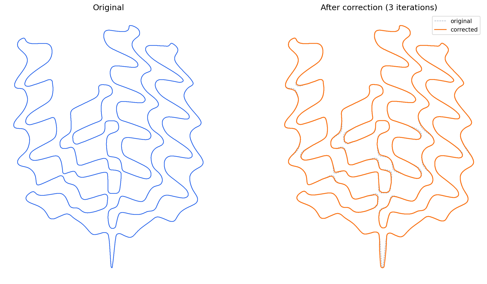

# Layout Optimization

A Python side project focused on **algorithmic geometry processing** for manufacturing-oriented contour correction.

This project explores how to detect and correct problematic local regions in 2D contours extracted from binary input, while preserving overall boundary continuity.

## Problem

Contours extracted from raster images can contain:

* narrow local regions
* jagged boundary artifacts
* fragmented correction spans
* shape distortion after naive global smoothing

A simple global smoother can improve continuity, but it does not distinguish between core problem regions and neighboring points that should only be influenced indirectly.

## Objective

Build a contour-correction pipeline that can:

* detect local violations
* apply correction selectively
* propagate displacement with controlled decay
* smooth local correction magnitude
* refit corrected spans

## Results

Left: original contour. Right: after 3 correction iterations — narrow channels are widened while the overall shape is preserved.



## Pipeline

```
binary input
    -> contour extraction          (cv/rasterize.py)
    -> pull_points                 detect violations, displace outward along inward normal
    -> interpolate_modified_spans  fill gaps between pulled points
    -> detect_core_spans           cluster pulled indices into contiguous spans
    -> smooth_pull_magnitude_field smooth pull magnitude within each span
    -> expand_neighborhood         extend each span to left/right neighbours
    -> apply_decayed_pull          linearly-decayed displacement on neighbour points
    -> smooth_core_displacement    smooth full displacement vector within spans
    -> refit_modified_spans        local Laplacian refit anchored outside each span
```

Each iteration uses a frozen reference of iter-0 inward normals to prevent direction flips as points move across iterations.

## Why It Fits Algorithm Roles

This project demonstrates:

* geometric data processing
* heuristic design
* local neighbourhood propagation
* constrained smoothing
* iterative refinement
* debugging and visualisation of intermediate states

It is especially relevant to roles involving computational geometry, computer vision, manufacturing optimisation, and applied algorithm engineering.

## Project Structure

```text
layout-optimization/
├── src/
│   ├── main.py              # single-pass pipeline
│   ├── main_iterate.py      # iterative pipeline (primary entry point)
│   ├── visualization.py
│   ├── utils.py
│   ├── cv/
│   │   └── rasterize.py     # image loading, contour extraction, rasterization
│   └── geometry/
│       └── correction/
│           ├── pull.py      # inward normal, pull_points
│           ├── span.py      # span detection, gap filling, neighbourhood expansion
│           ├── smooth.py    # magnitude and displacement smoothing
│           ├── decay.py     # decayed pull on neighbours
│           └── refit.py     # local Laplacian refit
├── examples/                # input PNGs and result figures
├── archive/                 # legacy and debug scripts
└── README.md
```

## Running

```bash
cd src
python main_iterate.py      # iterative pipeline
python main.py              # single-pass pipeline
```

Dependencies: `numpy`, `opencv-python`, `matplotlib`
